<div align="center">

# 标书助手 · tender-writer

**一套把"让 AI 写标书"从玩具变成工程的 Claude Skill + 工作流方案**

<sub>An engineering-grade Claude Skill for Chinese government tender writing</sub>

[](./LICENSE)
[](https://www.python.org/)
[]()
[](https://docs.claude.com)
[]()

</div>

---

## 为什么需要这个

写过标书的人都知道一件事:**让 AI 一次性生成整本技术标,结果要么漏答评分点、要么踩到废标条款**。问题不在于 AI 不够聪明,而在于"标书编制"本质上是一个合规问题——它需要严格的流程、可追溯的决策、逐项应答的证据链,而不是一篇漂亮的作文。

tender-writer 把这件事拆成 **5 个必须依次完成、每一步都可以停下来审查的阶段**,让 AI 负责体力活(解析、拆解、组装、核查),把判断权永远留在你手里。

- ✅ **评分办法逐项拆成 CSV 矩阵**,每一分都对应具体应答段落,杜绝漏答
- ✅ **own / partner / reference 三级素材隔离**,从机制上防止"引用了竞品业绩"这种事故
- ✅ **全阶段人工确认**,不允许一键生成整本标书
- ✅ **四种使用方式**:Claude Code(最佳)、Cline/Qwen Code、纯对话 AI、手动模式
- ✅ **venv 完全隔离**,双击 `install.bat` 即可,不污染系统 Python

## 工作流总览

```mermaid
flowchart LR
    A[招标文件<br/>PDF / docx] --> B[阶段 1<br/>解析]
    B --> B1[tender_brief.md<br/>结构化摘要]
    B1 --> C[阶段 2<br/>评分矩阵]
    C --> C1[scoring_matrix.csv<br/>逐分拆解]
    C1 --> D[阶段 3<br/>提纲反推]
    D --> D1[outline.md<br/>章节骨架]
    D1 --> E[阶段 4<br/>分章节撰写]
    E --> E1[tender_response.docx<br/>主交付物]
    E1 --> F[阶段 5<br/>合规终审]
    F --> F1[compliance_report.md<br/>漏答与废标核查]

    style B fill:#FFF4E6,stroke:#D97757
    style C fill:#FFF4E6,stroke:#D97757
    style D fill:#FFF4E6,stroke:#D97757
    style E fill:#FFF4E6,stroke:#D97757
    style F fill:#FFF4E6,stroke:#D97757
```



**每个阶段之间必须人工 review 中间产物再推进**——这是整套方案的第一原则,也是它和"一键生成标书"类工具的根本区别。

## 30 秒上手(Claude Code 方式)

```bash
# 1. 放到项目的 .claude/skills/ 目录下
git clone https://github.com/Hugin-Z/tender-writer.git .claude/skills/tender-writer

# 2. 双击 install.bat 准备 Python 环境(venv 隔离)
cd .claude/skills/tender-writer && install.bat

# 3. 在项目根目录启动 Claude Code,把招标文件拖进对话
claude
# > "帮我编制 XX 项目的技术标"
```

Claude Code 会自动加载 `SKILL.md`,按五阶段工作流引导你完成整本标书。其他 AI 工具(Cline / Qwen Code / 纯对话 AI)的使用方式见 [详细文档 →](./docs/USAGE.md)

## 看一眼真实产出

- 📄 [完整示例:一个脱敏的政府采购项目全流程](./examples/demo_project/)
- 📘 [完整使用文档](./docs/USAGE.md)
- 📙 [工作流设计哲学](./docs/DESIGN.md)(为什么是 5 个阶段,为什么严禁一键生成)

---

## 使用方式

### 方式一:Claude Code(推荐,体验最好)

> 全流程自动化,SKILL.md 自动触发,Python 脚本通过 `run_script.bat` 自动调用,中间产物自动落盘到 `output/`。

**操作步骤**:

1. 进入你打算放投标项目的工作目录(例如 `D:\我的投标项目\xxx标书\`)。
2. 在该目录下创建 `.claude\skills\` 子目录(若不存在),把整个 `tender-writer` 文件夹复制进去。最终路径形如 `D:\我的投标项目\xxx标书\.claude\skills\tender-writer\`。
3. 进入 `tender-writer` 文件夹,**双击 `install.bat`** 完成 Python 环境准备(详见下面"环境准备"一节)。
4. 在你的工作目录下启动 Claude Code(`claude`)。
5. 把招标文件拖进对话框,或者直接说:
   - "帮我解读这份招标文件,准备编制技术标"
   - "帮我编制 xxx 项目的技术方案"
   - "我要写投标书,先帮我做评分矩阵"

Claude Code 会通过 SKILL.md 中的触发关键词自动加载本 skill,并按五阶段工作流引导你完成整本标书。

---

### 方式二:其他能操作本地文件的 AI(Qwen Code / Trae / Cline + DeepSeek 等)

> 这类 AI 能读写本地文件、能执行 shell 命令,但不一定支持 Claude 的 SKILL.md 自动加载机制。需要你手动告诉它"按这份文档干活"。

**操作步骤**:

1. 把整个 `tender-writer` 文件夹复制到你的工作目录(放在哪个子目录都可以,例如 `xxx标书\tender-writer\`)。
2. 进入 `tender-writer` 文件夹,**双击 `install.bat`** 完成 Python 环境准备。
3. 在工作目录下启动你的 AI 工具(Qwen Code / Trae / Cline 等)。
4. **手动给 AI 一句指令,让它把 SKILL.md 当作工作指南**,例如:
   > "请先读取 `tender-writer/SKILL.md`,严格按照其中描述的五阶段工作流帮我编制技术标。所有 Python 脚本通过 `tender-writer/run_script.bat` 调用。我要处理的招标文件是:`D:\xxx\招标文件.pdf`。"
5. AI 读完 SKILL.md 后,会按阶段调用 `parse_tender.py` → `build_scoring_matrix.py` → `docx_builder.py` → `compliance_check.py`,中间产物正常落盘到 `output/`。
6. 每个阶段结束后,**你必须人工 review 中间产物**(`output/tender_brief.md`、`output/scoring_matrix.csv` 等),确认无误后再让 AI 推进下一阶段。

> ⚠️ 这类 AI 没有 SKILL.md 的自动加载和自动触发机制,工作流的"分阶段验证"原则需要你**主动看护**——不要让 AI 一次性把五个阶段全跑完。

---

### 方式三:纯对话 AI(Kimi / 智谱清言 / 豆包 / 文心一言 / ChatGPT 网页版等)

> 这类 AI 不能读写本地文件,也不能执行 Python 脚本。但它可以读懂 markdown、可以做多轮对话、可以"模拟"脚本的输出格式。整套方案仍然可用,只是中间产物需要你**手动复制粘贴**保存。

**操作步骤**:

1. 在你用的 AI 平台上,**新建一个专属对话或"智能体"**。建议起名 "标书编制助手"。
2. **把以下文件作为知识库上传给 AI**(几乎所有主流国产 AI 都支持知识库上传或多文件附件):
   - `SKILL.md` —— 五阶段工作流和禁止事项
   - `references/scoring_dimensions.md` —— 四大评分维度详解
   - `references/compliance_rules.md` —— 废标风险与合规清单
   - `references/doc_format_spec.md` —— 中文标书排版规范
   - `references/phrase_library.md` —— 话术库骨架
   - `templates/tender_brief.md` —— 招标解读模板
   - `templates/scoring_matrix.csv` —— 评分矩阵模板
   - `templates/outline_template.md` —— 提纲骨架
3. **每次开新投标项目时**,把招标文件(PDF 或 docx)也上传到这个对话/智能体里。
4. 在对话中**明确要求 AI 按五阶段推进**,例如:
   > "你已经读过 SKILL.md 的五阶段工作流。请先执行**阶段 1:招标文件解析**,严格按 `templates/tender_brief.md` 的字段输出,缺失字段标注【待补充】,不要脑补。等我确认后再进入阶段 2。"
5. AI 每输出一个阶段的产物(tender_brief.md / scoring_matrix.csv / outline.md / 章节正文),**你手动复制保存到工作目录的 `output/` 子目录下**(自己手动建一个)。
6. 阶段 4(分章节撰写)完成后,把 AI 输出的 markdown 内容**手工粘贴到 Word**,然后参照 `references/doc_format_spec.md` 应用正确的字体字号、页边距、目录、页眉页脚。
7. 阶段 5(合规终审)由 AI 对照 `references/compliance_rules.md` 的检查清单逐项核查,输出合规报告。

> ⚠️ 方式三的取舍:
>
> - **Python 脚本无法执行**(`parse_tender.py` / `build_scoring_matrix.py` / `compliance_check.py` / `docx_builder.py` 都跑不了),但 AI 可以**模拟它们的输出格式**(脚本的 docstring 写得很清楚,AI 看一眼就懂要输出什么)。
> - **docx 自动生成无法实现**,最终需要你手工排版到 Word(参考 `references/doc_format_spec.md`)。
> - **覆盖度自动核查无法实现**,需要你或 AI 人工对照 scoring_matrix.csv 逐项打钩。
> - 但**五阶段工作流、四条设计原则、禁止事项、话术库、合规清单**都可以正常生效——这才是这套方案最有价值的部分。

---

## 环境准备

### 第一步:确保电脑装了 Python 3.10 或更高版本

打开命令提示符(在开始菜单搜 `cmd`),输入:

```bash
python --version
```

如果显示 `Python 3.10.x` 或更高版本,直接进入第二步。

如果提示"不是内部或外部命令",或版本低于 3.10,请去官网下载安装:[python.org/downloads](https://www.python.org/downloads/)

⚠️ 安装时**一定要勾选** "Add Python to PATH" 选项,否则后续步骤会失败。

### 第二步:双击 install.bat

进入 `tender-writer` 文件夹,**双击 `install.bat`**。

脚本会自动:

- 检查 Python 是否已安装
- 在 `tender-writer` 文件夹内创建一个隔离的虚拟环境(`.venv\`)
- 把所有依赖装到这个虚拟环境里(完全不影响你电脑上其他 Python 项目)

整个过程根据网速一般需要几分钟。看到"环境准备完成"就可以使用了。

> 💡 venv 完全隔离,不污染系统环境。哪天不想用了,直接删除 `tender-writer\.venv\` 文件夹即可。

---

## 五个阶段会产出什么

| 阶段 | 产物文件 | 用途 |
|---|---|---|
| 阶段 1:招标文件解析 | `output/tender_brief.md`、`output/tender_brief.json` | 招标文件的结构化解读结果,所有后续工作的事实来源 |
| 阶段 2:评分矩阵构建 | `output/scoring_matrix.csv` | 每一分都对应到具体应答章节,Excel 可直接打开 |
| 阶段 3:提纲生成 | `output/outline.md` | 基于评分矩阵反推出的标书章节结构 |
| 阶段 4:分章节撰写 | `output/tender_response.docx` | 主交付物,逐章追加 |
| 阶段 5:合规终审 | `output/compliance_report.md` | 漏答清单、废标风险清单、格式合规清单 |

推荐命令顺序:

```bat
run_script.bat parse_tender.py "D:\项目\xxx招标文件.pdf"
run_script.bat build_scoring_matrix.py output/tender_brief.md
run_script.bat generate_outline.py output/scoring_matrix.csv
run_script.bat docx_builder.py --out output/tender_response.docx --project "项目名" --bidder "投标人"
run_script.bat append_chapter.py output/tender_response.docx output\chapter_01.md
run_script.bat compliance_check.py output/tender_response.docx output/scoring_matrix.csv
```

素材库辅助命令:

```bat
run_script.bat add_company.py "某某科技有限公司" partner --alias "某某科技"
run_script.bat ingest_assets.py 业绩 own_default
run_script.bat triage_unsorted.py
run_script.bat triage_unsorted.py --apply
```

回归测试:

```bat
python -m unittest discover -s tests -v
```

说明:

- `tests/` 会把整个 `tender-writer/` 复制到系统临时目录后再执行，不会直接改你的正式素材库。
- 这些临时测试副本在测试结束后会自动删除；即使残留，也可以直接手动删除。
- 正式目录下的 `tests/` 代码、`output/` 成果和真实 `assets/` 素材不要当成“测试垃圾”直接清掉。

**重要**:这五个阶段必须严格依次进行,每个阶段都要 review 中间产物再推进下一步。这是为了确保最终标书不漏答、不踩雷,**绝不允许跳过或一键生成**。

---

## 素材库与知识库

tender-writer 维护两套长期资产,职责完全分开,**不能混用**:

| 维度 | `assets/`(成品素材库) | `references/knowledge_base/`(学习参考库) |
|---|---|---|
| 性质 | **可直接抄进标书的原料** | **只能学习风格的参考材料** |
| 组织方式 | 按"类别 / 公司 id"两级隔离 | 不按公司分目录,但 frontmatter 标注来源公司 |
| 是否影响标书正文 | ✅ 是,正文中所有具体素材都从这里取 | ❌ 否,只影响 AI 撰写时的结构与话术风格 |
| 是否允许 reference 公司 | ❌ **严禁**,reference 永远不能进 assets | ✅ 允许(且 reference 类型只能进这里) |
| review 流程 | 有 pending → approved 流程 | 也有,但宽松,主要看是否吸收为风格参考 |

> 一句话:**能直接抄进标书的放 `assets/`,只能参考风格的放 `references/knowledge_base/`**。

---

## 公司归属三类型

所有进入 `assets/` 或 `knowledge_base/` 的素材,都必须在 `companies.yaml` 中注册一个 `company_id`,并标明 `company_type`。三种类型差异巨大:

| 类型 | 定义 | 可用场景 | 严格禁止 |
| --- | --- | --- | --- |
| **own** | 我方主体公司(可能多家关联实体) | 资质、业绩、人员、图表、话术均可**直接引用**进标书正文 | 无特殊禁止 |
| **partner** | 合作方 / 联合体成员 / 分包方 | 仅在联合体投标且招标文件允许时,可引用其素材;**必须**在文中或附件中标注"由 [partner 公司名] 提供" | ❌ 严禁不标注来源就引用 |
| **reference** | 竞品 / 行业标杆 / 公开案例 | 仅作为学习参考,可吸收其结构、应答策略、话术风格 | ❌ **严禁**任何具体业绩/资质/人员/金额数据进入标书正文;❌ **严禁**进入 `assets/`,只能进 `references/knowledge_base/` |

> 🔴 **reference 是高压线**。即使用户说"这家公司的某段写得很好,抄一下",也必须拒绝。违反就是合规事故。

新增公司请在 Claude Code 中说"新增公司",AI 会引导你完成注册并自动创建对应目录。**不要手动编辑 `companies.yaml`**。

---

## 如何更新材料库

材料入库有三个入口,根据你对材料的了解程度选择:

### 入口 A:已知分类(类别和公司都明确)

**适用**:你清楚地知道这份材料是某家公司的资质 / 业绩 / 简历 / 图表 / 话术。

**操作**:

1. 直接把文件丢到对应目录的 `_inbox/` 里:
   - `assets/类似业绩/<company_id>/_inbox/`
   - `assets/团队简历/<company_id>/_inbox/`
   - `assets/公司资质/<company_id>/_inbox/`
   - `assets/通用图表/<company_id>/_inbox/`
   - `assets/标准话术/<company_id>/_inbox/`
2. 在 Claude Code 中说一句:
   - "处理业绩 inbox"
   - "处理 own_jiao 公司的简历 inbox"
   - "处理 partner_xinda 的资质 inbox"

AI 会调用 `extract_text.py` 提取文字、按 schema 结构化、追加索引、归档原文件、生成摄入报告。

### 入口 B:不确定分类(混合材料)

**适用**:你拿到一份混合材料(例如往期完整投标包),内部同时包含案例、业绩、简历;或者你不确定该归到哪一类。

**操作**:

1. 把文件丢到根目录的 `_inbox_unsorted/` 里。
2. 在 Claude Code 中说:
   - "处理 _inbox_unsorted"
   - "我有一堆材料不知道怎么分类"

AI 会逐份扫描、生成**分类建议**(目标类别 + 目标公司 + 判断理由 + 目标路径),**等待你逐条确认**后才会分发。

### 入口 C:新增合作方或参考公司

**适用**:要登记一家新的 partner 或 reference 公司。

**操作**:在 Claude Code 中说"新增公司",AI 会询问公司全称、类型、描述,生成 id,自动追加到 `companies.yaml`,并(若为 own/partner)自动初始化 `assets/` 下的对应子目录。

### 通用后续步骤(三种入口都要做)

无论走哪个入口,摄入完成后都要:

1. 查看 AI 生成的**摄入报告**或 **triage 报告**
2. 逐条 review 新生成的 `.md` 文件,补全标注为 `TODO:待人工确认` 的字段
3. 把 frontmatter 的 `review_status` 从 `pending` 改为 `approved`
4. 删除文件末尾的 `## TODO 清单` 区块

> ⚠️ **只有 `review_status=approved` 的素材才能被新标书引用**。`pending` 状态视为未入库。

---

## 关键词触发

只要你的对话中出现以下任一关键词,Claude Code 会自动加载本 skill;其他 AI 工具识别到这些词时也建议你主动让它读取 SKILL.md:

- 招标文件、招标公告、采购文件、采购需求
- 投标、技术标、商务标、投标书、投标方案、投标响应文件、应答文件
- 技术方案应答、技术方案、需求应答
- 评分办法、评标办法、评分矩阵
- 废标条款、实质性响应、★条款、▲条款、资格要求
- 政府采购、竞争性磋商、单一来源采购
- 标书编制、标书撰写、智慧城市标书、数字乡村标书
- 处理 inbox、处理 _inbox_unsorted、新增公司、素材摄入

---

## 已知局限

1. **只处理技术标**,不处理商务标(报价表、商务条款应答、付款条件等)和价格标。
2. **只针对中文政府类项目**,英文标书或纯商业项目的国际标不在范围内。
3. **不替代法务对废标条款的最终判断**。`compliance_check.py` 只是辅助核查,关键废标风险点仍需法务/标书经理人工复核。
4. PDF 解析依赖 pdfplumber,**扫描件 PDF**(非文字 PDF)无法直接识别,需先 OCR 转换。
5. 本地化信息(项目所在地的地理、产业、人口等)**必须由用户人工提供或确认**,模型不会编造。
6. 方式三(纯对话 AI)下,docx 自动排版、覆盖度自动核查、繁简自动转换等依赖 Python 脚本的能力都无法使用。
7. 素材摄入流程依赖 `extract_text.py` 和 venv,在方式三下也无法自动执行,只能由用户手动整理后让 AI 按 schema 模板填写。

---

## 目录结构

```
tender-writer/
├── SKILL.md                      ← skill 主入口,Claude Code 会自动加载;其他 AI 也可手动读取
├── README.md                     ← 你正在看的这份文档
├── companies.yaml                ← 公司注册表(集中事实来源,所有公司在此登记)
├── requirements.txt              ← Python 依赖清单
├── install.bat                   ← 一键环境准备脚本(双击运行)
├── run_script.bat                ← 通过 venv 调用脚本的入口
│
├── references/                   ← 知识参考与学习材料
│   ├── scoring_dimensions.md     ← 四大评分维度详解
│   ├── compliance_rules.md       ← 废标风险与合规清单
│   ├── doc_format_spec.md        ← 中文标书排版规范
│   ├── phrase_library.md         ← 通用话术骨架
│   └── knowledge_base/           ← 学习参考材料库(只学风格,不进正文)
│       ├── 历史标书案例/
│       ├── 评标专家偏好/
│       ├── 行业术语对照/
│       └── 失败教训/
│
├── assets/                       ← 可调用成品素材库(按公司隔离)
│   ├── .ingest_history.json      ← 摄入去重记录
│   ├── 公司资质/<company_id>/
│   ├── 类似业绩/<company_id>/
│   ├── 团队简历/<company_id>/
│   ├── 通用图表/<company_id>/
│   └── 标准话术/<company_id>/
│
├── _inbox_unsorted/              ← 待分类材料临时区(触发 triage 流程)
│
├── scripts/                      ← Python 脚本
│   ├── parse_tender.py           ← 阶段 1:招标文件解析
│   ├── build_scoring_matrix.py   ← 阶段 2:评分矩阵构建
│   ├── compliance_check.py       ← 阶段 5:合规终审
│   ├── docx_builder.py           ← docx 构建工具模块
│   └── extract_text.py           ← 通用文本提取(供素材摄入流程调用)
│
└── templates/                    ← 输出模板
    ├── tender_brief.md
    ├── scoring_matrix.csv
    └── outline_template.md
```

---

## 常见问题

- **install.bat 报错**:大概率是 Python 未安装或未加入 PATH。重新装一次 Python 并勾选"Add to PATH"。
- **install.bat 卡在下载依赖**:可能是网络问题,可以手动用国内镜像:`pip install -r requirements.txt -i https://pypi.tuna.tsinghua.edu.cn/simple`(也可以直接编辑 install.bat 把 pip install 那行改成带 `-i` 参数的版本)
- **脚本找不到**:确认你是在 `tender-writer` 文件夹内运行的,且 `.venv` 目录已生成。
- **解析 PDF 没文字**:你的 PDF 可能是扫描件,需要先用 OCR 工具转成文字版 PDF。
- **Excel 打开 CSV 中文乱码**:本方案生成的 CSV 是 UTF-8 with BOM,正常情况下 Excel 不会乱码。如果仍乱码,用 WPS 打开,或者用记事本另存为时选 ANSI 编码。
- **方式三下 AI 输出的内容超出对话长度**:让 AI 一章一章输出,不要一次性输出全部正文。这本来就是工作流的硬性要求。
- **AI 把 reference 类型的材料写进了 assets**:这是高压线违规,立即停止并要求 AI 撤回,把材料移回 `references/knowledge_base/`。SKILL.md 第三章和第十章已经明确禁止此行为,如果反复发生请反馈给方案维护人。

如有其他问题,联系方案维护人:**laplace.dice@gmail.com**

---

## 版本与维护

- 当前版本:v1.1
- 维护方式:本方案设计为团队内复制分发,任何人都可以在自己副本里改进 references、templates、assets,然后回流到主版本(注意:回流时**不要回流 assets/ 下的具体素材**——那是各团队各自的资产)。
